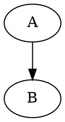

# Agent Guide

This repository powers Elecmonkey's Garden, a bilingual technical blog built with Rsbuild, React Router, React SSG, and a Rust-backed Markdown content compiler.

## Content Layout

- Chinese posts live in `content/posts`.
- English posts live in `content/en/posts`.
- Posts are grouped by month folders such as `202606`.
- The same slug can exist in both locales, but translation is not automatic.
- Keep Chinese and English pages synchronized when adding, removing, renaming, or materially updating content. If a post exists in one locale, create or update its counterpart in the other locale unless the task explicitly says otherwise.
- Generated site data lives under `packages/site/src/generated`. Do not edit generated files manually.
- The site imports generated content at runtime and SSG time. Re-run the site build after changing content or compiler behavior.

## Post Frontmatter

Every post is a Markdown file with YAML frontmatter:

```md
---
title: 'Post Title'
date: 'YYYY-MM-DD'
description: 'A short description of the post'
tags: ['Tag 1', 'Tag 2']
author: 'Elecmonkey'
---

Post content...
```

Supported optional fields include draft/visibility-style metadata used by the content compiler. Before inventing new frontmatter, inspect `packages/content-compiler-napi/src-js/index.ts` and the generated `PostData` type in `packages/site/src/lib/api.ts`.

## Content Build Flow

- `pnpm build` runs the site build, which invokes `@elecmonkey/garden-content-compiler` through `packages/site/rsbuild.config.ts`.
- The compiler parses Markdown, frontmatter, table of contents, static HTML, search indexes, and Markdown islands.
- The default content cache is under `packages/site/.garden-cache/content` when the site build runs from `packages/site`.
- If compiler output shape changes, bump the compiler schema/cache version so stale generated HTML is not reused.
- After changing Markdown compiler behavior, run at least `cargo test -p garden-md-compiler` and `pnpm --filter @elecmonkey/garden-site build`.

## Client Navigation Loading

- Client route modules are preloadable in `packages/site/src/app-shell/PageRoutes.client.tsx`, and every client page route must have a matching loader in `packages/site/src/app-shell/routes.client.tsx`. The loader keeps the previous page visible while `NavigationProgress` reports navigation at the top of the viewport.
- Prefetch remains best-effort and silent. Route loaders should also await data required for the target page's first meaningful render, such as article content or the search index; do not add visible page-level loading fallbacks.
- Keep client and SSG route IDs synchronized through `create-routes.tsx`. The client marks the initially matched SSG routes as hydrated so route loaders do not rerun during first-page hydration.

## Markdown Islands

Markdown islands are static HTML regions emitted by the Rust compiler and enhanced in the browser by `packages/site/src/components/article/enhancer/*`. They preserve readable fallback HTML for no-JS scenarios while enabling client-side behavior only where needed.

The island metadata type is `MarkdownIsland` in `packages/site/src/lib/api.ts`. The Rust source of truth is under `crates/md-compiler/src/islands`.

### Code Blocks

Any normal fenced code block becomes a `code` island.

````md
```ts
const value = 1;
```
````

Use `{...}` after the language to mark line ranges:

````md
```ts{1-2}
const value = 1;
console.log(value);
```
````

Notes:

- The language is stored as `data-language` and shown as the block label.
- The range is stored as `data-range` and processed by the code-line enhancer.
- A copy button is added by the article enhancer.
- An empty language fence is valid and becomes a plain code island.

### Mermaid Diagrams

Use a `mermaid` fenced block:

````md

````

Notes:

- The compiler emits a `mermaid` island with the source as fallback code.
- The browser enhancer lazy-loads Mermaid only when Mermaid islands are present.
- Keep Mermaid source self-contained inside the fence.

### Graphviz Diagrams

Use `viz` or `graphviz` fenced blocks for DOT source:

````md
```viz
digraph G {
  rankdir=LR;
  A -> B;
}
```
````

`graphviz` is an alias:

````md

````

Optional scale syntax is supported in fence metadata:

````md
```viz {0.75}
digraph G {
  A -> B;
}
```
````

Notes:

- Scale must be a finite positive number.
- The compiler emits `data-scale` when a valid scale is provided.
- The browser enhancer dynamically imports `@viz-js/viz` only when Graphviz islands exist.
- The fallback HTML is a `language-dot` code block.
- The enhancer adapts common black/white SVG colors for the site theme.

### File Download Cards

Use a `file` fenced block. The content is line-based:

````md
```file
example.pdf
pdf
https://example.com/example.pdf
A short description for the file.
2MB
```
````

Line order:

1. Filename
2. File type
3. URL
4. Description
5. Size

Notes:

- Empty lines are treated as missing values.
- The compiler stores filename, type, URL, and size as `data-*` attributes.
- The description is rendered in fallback HTML and read by the browser enhancer.
- The browser enhancer replaces the fallback with a styled download card.

## Markdown Rendering Notes

- Raw user-authored HTML is omitted by the compiler for safety.
- Inline and display math are rendered with KaTeX during compilation.
- Heading anchors and table-of-contents IDs are generated by the compiler. Do not hand-code heading anchors in Markdown.
- Images, links, tables, task lists, and regular Markdown syntax should be written normally.
- Prefer adding compiler tests in `crates/md-compiler/src/tests.rs` when changing Markdown behavior.

## Dependency Notes

- The site should normally depend on a published `@elecmonkey/garden-content-compiler` version.
- Temporarily switching to `workspace:*` is useful for local compiler development, but switch back to the published version before final verification unless the task explicitly requires workspace linking.
- When adding a new island with a client dependency, ensure the dependency is dynamically imported if it should not affect pages that do not use the island.

## Content Compiler Release Flow

The content compiler is published through GitHub Actions with npm Trusted Publishing. Do not publish it manually from a local machine unless explicitly requested.

Release package set:

- `@elecmonkey/garden-content-compiler`
- `@elecmonkey/garden-content-compiler-darwin-arm64`
- `@elecmonkey/garden-content-compiler-linux-x64-gnu`
- `@elecmonkey/garden-content-compiler-linux-x64-musl`

Bump checklist:

- Update the root `package.json` version.
- Update `[workspace.package].version` in `Cargo.toml`.
- Update `packages/content-compiler-napi/package.json` version.
- Update all `packages/content-compiler-napi/package.json` `optionalDependencies` platform package versions to the same version.
- If the site should consume the new compiler, update `packages/site/package.json` to the same published `@elecmonkey/garden-content-compiler` version. Do not leave it as `workspace:*` for release or deployment.
- Run `pnpm install --lockfile-only` to refresh `pnpm-lock.yaml`.

Before tagging, run the relevant checks:

```bash
cargo test -p garden-md-compiler
cargo test -p garden-content-compiler
pnpm --filter @elecmonkey/garden-content-compiler check
pnpm --filter @elecmonkey/garden-site build
```

Publishing is triggered by pushing a tag that matches the compiler package version:

```bash
git tag garden-content-compiler-vX.Y.Z
git push origin garden-content-compiler-vX.Y.Z
```

The workflow at `.github/workflows/publish-content-compiler.yml` validates that the tag equals `garden-content-compiler-v${packages/content-compiler-napi/package.json.version}` and that all optional platform dependency versions match. It builds native artifacts in a matrix, prepares npm platform packages, publishes the three platform packages first, and publishes the main package last using `npm publish --provenance --access public`.
