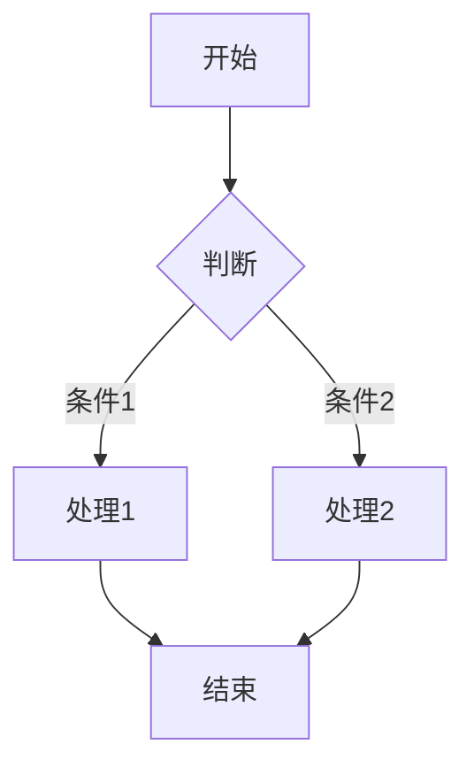

# Elecmonkey Garden

个人技术博客，基于 [Next.js](https://nextjs.org) 开发中。

## 技术栈

- **框架**: Next.js
- **前端**: React
- **样式**: TailwindCSS
- **内容管理**: MDX + Markdown
- **代码处理**: React Syntax Highlighter（基于 PrismJS）
- **图表渲染**: Mermaid（客户端渲染）

## 设计特点

### 内容渲染

- **Markdown 渲染**: 使用 react-markdown 进行 Markdown 渲染
- **代码语法高亮**: 支持多种编程语言的自动语法高亮
- **图表支持**: 通过 Mermaid 集成支持流程图、时序图、类图等多种图表
- **响应式图片**: 自动优化图片显示效果
- **暗色模式**: 支持明暗主题切换，代码块和图表自动适应主题

### 文件组织

- **按月归档**: 博客文章按月份组织，便于管理和访问
- **元数据支持**: 所有内容支持丰富的元数据（标题、日期、标签等）

## 本地开发

1. 克隆项目并安装依赖:

```bash
git clone <仓库地址>
cd <项目文件夹>
npm install
# 或
yarn install
# 或
pnpm install
```

2. 启动开发服务器:

```bash
npm run dev
# 或
yarn dev
# 或
pnpm dev
# 或
bun dev
```

在浏览器中打开 [http://localhost:3000](http://localhost:3000) 查看结果。

## 项目编译

要为生产环境编译项目，运行以下命令：

```bash
pnpm build
```

编译完成后，可以运行生产环境服务器：

```bash
pnpm start
```

## 服务端部署

### Linux 服务器部署（使用 PM2）

1. 确保服务器上已安装 Node.js (推荐 v20+), pnpm 和 pm2

2. 克隆代码并安装依赖:

```bash
git clone <仓库地址> /path/to/your/app
cd /path/to/your/app
pnpm install
```

3. 构建应用:

```bash
pnpm build
```

4. 使用 PM2 启动服务:

```bash
pm2 start node_modules/.bin/next --name "elecmonkey-garden" -- start -p 3000
```

5. 设置开机自启:

```bash
pm2 startup
pm2 save
```

6. 查看运行状态:

```bash
pm2 status
pm2 logs elecmonkey-garden
```

7. 更新部署:

```bash
cd /path/to/your/app
git pull
pnpm install
pnpm build
pm2 reload "elecmonkey-garden" || pm2 start node_modules/.bin/next --name "elecmonkey-garden" -- start -p 3000
```

### PM2 启动命令

```bash
# 首次启动
pm2 start node_modules/.bin/next --name "elecmonkey-garden" -- start -p 3000

# 重新加载已有应用
pm2 reload "elecmonkey-garden"

# 或组合命令（先尝试重载，若失败则启动）
pm2 reload "elecmonkey-garden" || pm2 start node_modules/.bin/next --name "elecmonkey-garden" -- start -p 3000
```

### 不使用 PM2 的部署方法

如果您不想使用 PM2，也可以通过以下方式部署：

#### 方法1：使用 systemd 服务（推荐）

1. 创建 systemd 服务文件:

```bash
sudo nano /etc/systemd/system/elecmonkey-garden.service
```

2. 添加以下内容（根据您的实际路径和用户进行修改）:

```ini
[Unit]
Description=ElecMonkey Garden Next.js App
After=network.target

[Service]
Type=simple
User=<your-username>
WorkingDirectory=/path/to/your/app
ExecStart=/usr/bin/npm start
Restart=on-failure
Environment=NODE_ENV=production

[Install]
WantedBy=multi-user.target
```

3. 启用并启动服务:

```bash
sudo systemctl enable elecmonkey-garden
sudo systemctl start elecmonkey-garden
```

4. 查看服务状态:

```bash
sudo systemctl status elecmonkey-garden
sudo journalctl -u elecmonkey-garden
```

#### 方法2：使用 screen 或 tmux（简单方案）

1. 安装 screen 或 tmux:

```bash
# 使用 screen
sudo apt install screen

# 或使用 tmux
sudo apt install tmux
```

2. 创建一个新会话并启动应用:

```bash
# 使用 screen
screen -S garden
cd /path/to/your/app
npm start

# 使用 Ctrl+A 然后按 D 分离会话
```

或

```bash
# 使用 tmux
tmux new -s garden
cd /path/to/your/app
npm start

# 使用 Ctrl+B 然后按 D 分离会话
```

3. 重新连接到会话:

```bash
# screen
screen -r garden

# tmux
tmux attach -t garden
```

#### 方法3：使用 nohup（简易方法）

```bash
cd /path/to/your/app
nohup npm start > app.log 2>&1 &
```

这会在后台运行应用并将输出重定向到 app.log 文件。

### 反向代理配置

通常建议在前端配置反向代理服务器。

#### Nginx作为反向代理配置

```nginx
server {
    listen 80;
    server_name yourdomain.com www.yourdomain.com;

    location / {
        proxy_pass http://localhost:3000;
        proxy_http_version 1.1;
        proxy_set_header Upgrade $http_upgrade;
        proxy_set_header Connection 'upgrade';
        proxy_set_header Host $host;
        proxy_cache_bypass $http_upgrade;
    }
}
```

#### Caddy作为反向代理配置

Caddy 是一个现代化、自动配置 HTTPS 的 Web 服务器，配置更简单：

```
yourdomain.com {
    reverse_proxy localhost:3000
}
```

Caddy 会自动获取和续期 HTTPS 证书，极大简化了配置过程。安装方法：

```bash
# Debian/Ubuntu
sudo apt install -y debian-keyring debian-archive-keyring apt-transport-https
curl -1sLf 'https://dl.cloudsmith.io/public/caddy/stable/gpg.key' | sudo gpg --dearmor -o /usr/share/keyrings/caddy-stable-archive-keyring.gpg
curl -1sLf 'https://dl.cloudsmith.io/public/caddy/stable/debian.deb.txt' | sudo tee /etc/apt/sources.list.d/caddy-stable.list
sudo apt update
sudo apt install caddy

# 启动服务
sudo systemctl enable caddy
sudo systemctl start caddy
```

## 环境变量配置

使用环境变量进行配置。创建 `.env.local` 文件并设置以下变量：

```
# 站点 URL
NEXT_PUBLIC_SITE_URL=https://yourdomain.com

# 分析工具 (可选)
NEXT_PUBLIC_ANALYTICS_ID=your_analytics_id
```

对于生产环境，可以在 PM2 的配置文件中设置环境变量。

## 内容管理

博客文章存储在 `src/content/posts` 目录中，使用 Markdown 格式。每篇文章需要包含以下前置元数据：

```md
---
title: '文章标题'
date: 'YYYY-MM-DD'
description: '文章简短描述'
tags: ['标签1', '标签2']
---

文章内容...
```

### Mermaid 图表使用方法

在 Markdown 中使用 Mermaid 图表，只需要创建一个 `mermaid` 代码块：

```markdown


支持的图表类型包括：流程图、时序图、类图、甘特图等。

## 自定义与扩展

### 主题定制

修改 `tailwind.config.js` 文件来自定义主题颜色、字体等。

### 添加新页面

在 `src/app` 目录下创建新目录和 `page.tsx` 文件，遵循 Next.js App Router 的约定。

## 许可协议

### 代码部分
源代码采用 [MIT 许可证](LICENSE)。

### 内容部分
所有博客文章、图片和其他创意内容采用 [知识共享署名-非商业性使用-相同方式共享 4.0 国际许可协议（CC BY-NC-SA 4.0）](https://creativecommons.org/licenses/by-nc-sa/4.0/deed.zh)。