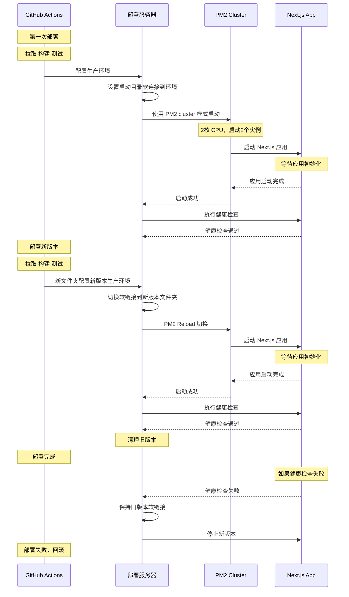

> This article was translated by AI and has not been manually reviewed.

## Blue-Green Deployment

**Blue-green deployment** is a zero-downtime deployment strategy. Its core idea is to maintain two completely identical environments: one running the current version, the so-called blue environment, and another deploying the new version, the so-called green environment. After the new version is deployed and verified, user requests are smoothly switched from the blue environment to the green environment, achieving zero-downtime deployment.

This **smooth switch** is quite mysterious. For applications supported by Node.js, PM2 is a common deployment tool. PM2's **Cluster mode** allows creating multiple processes for a Node.js application, distributed across multiple CPU cores for execution (if your server has multiple cores, though single-core is also fine; two instances on one core can still time-slice in parallel), achieving a certain degree of concurrency and CPU load balancing.

**`pm2 reload`** restarts processes under Cluster mode one by one without interrupting service. When PM2 starts restarting, it first starts a new process. Only after the new process has fully started and is running normally will it gracefully close the old process. This way, during the restart process, there is always a process providing service, achieving zero-downtime updates.

So how do we change the production code as quickly as possible? **Symbolic links** are a good thing. During PM2 deployment, point the PM2 app to the symbolic link of the currently running version, such as `current` -> `releases/oldVersion`, instead of directly using a fixed directory. When deploying a new version, we first deploy it to a new directory, such as `releases/newVersion`, and then switch instantly by updating the symbolic link. The advantage of this method is that the switch is an atomic operation with almost no downtime, and if the new version has problems, the symlink can immediately be pointed back to the old version, making rollback easy. But there is a small pitfall: Node.js will be clever and resolve symbolic links. Adding the `--preserve-symlinks` parameter can avoid this issue. I only found the reason after digging through the Node.js [`preserve-symlinks` documentation](https://nodejs.org/api/cli.html#cli_preserve_symlinks).

Using the deployment timestamp as the directory name saves the effort of judging old and new environments. Creating a folder using the current time will not conflict with previous ones.

For production applications that also generate files, such as user uploads, you can create a folder under the application root for sharing. Each time a new version is deployed, data in the shared directory does not switch together with version control.

```dir
/APP_ROOT
├── shared  # 共享数据
├── current -> releases/release-20250320-140000/  # 软连接
└── releases/
    ├── release-20250320-140000/  # 旧版本
    └── release-20250325-153030/  # 新版本
```

```bash
# 原子操作切换符号链接
ln -sfn "$RELEASE_DIR" "$CURRENT_LINK.new"
mv -T "$CURRENT_LINK.new" "$CURRENT_LINK"
```

After updating, run `pm2 reload`, and **it seems** our zero-downtime deployment is designed. Seems? Theoretically this should be fine, right?

## Next.js Deployment under PM2 Cluster Mode

Can setting `instances: 2` in `ecosystem.config.js` make a Next.js application run two instances on a dual-core server? I was naive. After deploying as above, GitHub Actions showed success, and the page opened normally, so it seemed everything really went smoothly. Luckily, I glanced at PM2 logs. Good grief: only one instance was always working normally, while the other kept restarting abnormally at high frequency.

At first, I thought PM2's two instances could not listen on the same port and that I needed to configure load balancing myself in a reverse proxy like Caddy or Nginx. Later, after searching through various materials, I realized I had wrongly blamed PM2. Multiple instances listening on the same port with automatic load balancing is one of PM2's core features (criticism for PM2's official docs: too brief, like a beginner guide). The problem was with Next.js.

Next.js's `pnpm start` command conflicts in multi-instance deployment. Then what to do? After some searching, compiling with `standalone` mode can solve this problem:

```json
{
  "scripts": {
    "build": "next build --standalone"
  }
}
```

When compiled in `standalone` mode, Next.js provides an output containing an independent server, which can be started with `server.js`. The build output can directly start the service with `node .next/standalone/server.js`, so PM2 can normally start multiple copies.

```shell
# 如果应用不存在，则首次启动
if ! pm2 list | grep -q "app"; then
  echo "首次启动应用..."
  NODE_OPTIONS="--preserve-symlinks" pm2 start server.js \
    --name app \
    -i 2 \
    --time \
    --max-memory-restart 768M \
    --kill-timeout 5000 \
    --no-autorestart \
    --no-watch \
    --env production \
    --update-env \
    --cwd "$CURRENT_LINK"
else
  echo "平滑重载应用..."
  NODE_OPTIONS="--preserve-symlinks" pm2 reload app \
    --update-env \
    --max-memory-restart 768M \
    --kill-timeout 5000 \
    --restart-delay=5000
fi
```

## Missing Static Assets and Next.js Build Output

I thought the problem was solved, but then the website frontend had JS and CSS display issues. After various investigations, I finally found the root cause: the automatic build result `.next/standalone` directory is actually an independent project. It does not depend on other artifacts in the parent `.next` folder. In fact, it contains its own independent `.next` folder inside (yes, `./.next/standalone/.next`; I do not know who designed this). So the external `static` folder needs to be copied into `standalone`. By default, the build output `.next/static` and `.next/standalone` are siblings. The hierarchy was wrong, so problems kept occurring. The correct directory structure should be:

```dir
.next/
├── standalone/
│   ├── .next
│   ├── src      # .md原始文件，SSR渲染用
│   ├── server.js
│   ├── package.json
│   └── static/  # 需要把 static 文件夹拷贝到这里
└── static/      # 原始静态资源
```

Since `standalone/` can be used as an independent project, the outside layer is no longer needed. But this layer does not have a `pnpm-lock.yaml` file, so copy one from the outermost layer. In this case, the deployment script needs to carefully reconsider which files are necessary.

As for how I learned the correct configuration after finding the problem: praise for Next.js documentation. The main reference was [Next.js build output documentation](https://nextjs.org/docs/app/api-reference/config/next-config-js/output).

```shell
mkdir -p deploy

cp -r .next/standalone/.next deploy/
cp -r .next/standalone/src deploy/
cp -r .next/standalone/package.json deploy/
cp -r .next/static deploy/.next/

cp .next/standalone/server.js deploy/
cp pnpm-lock.yaml deploy/
cp ecosystem.config.js deploy/

echo "部署目录总大小："
du -sh deploy/
```

After this modification, the Next.js application can load static assets normally.


