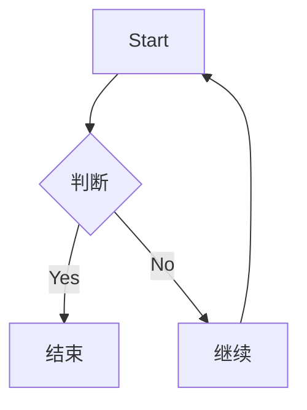
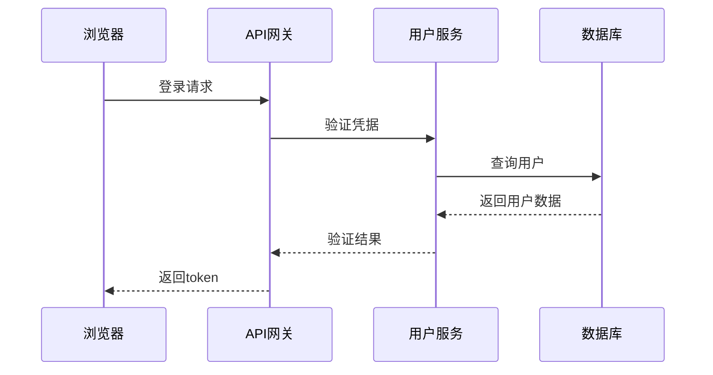
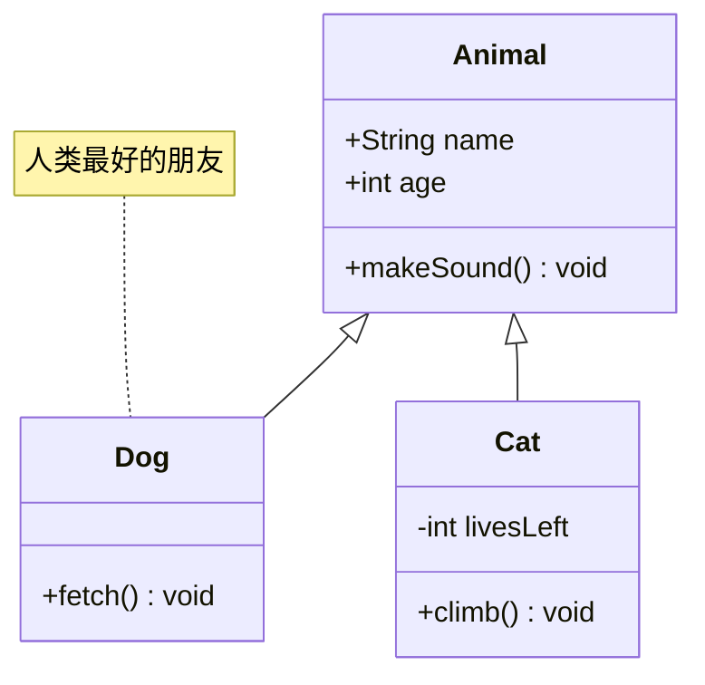
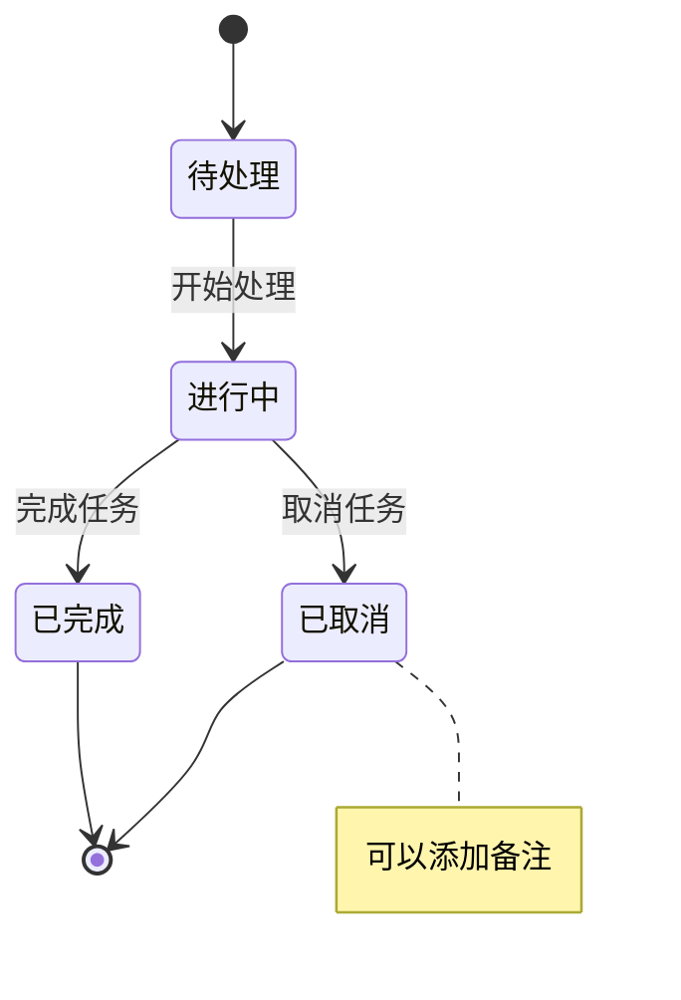
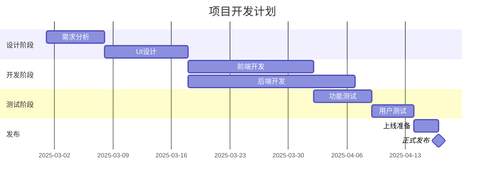
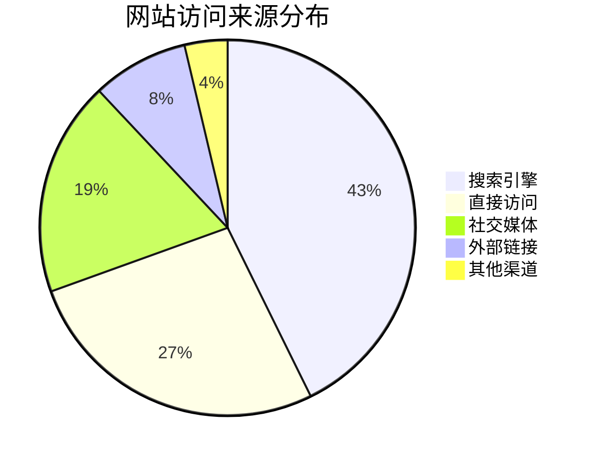

> This article was translated by AI and has not been manually reviewed.

Mermaid is not a magical diagramming tool. Its DIY capability is poor, and its styles are monotonous. If you are drawing relatively complex diagrams, there is almost no doubt that you had better use tools like [draw.io](https://draw.io/). But since almost all of my not-especially-formal documents have become Markdown, I often need to draw some simple schematic diagrams while writing documentation. At that point, going to a professional drawing tool inevitably makes me wonder: why can't diagrams be like mathematical formulas, with a LaTeX-like, keyboard-only solution that can be embedded in Markdown?

The answer is Mermaid.

As usual, let's first try the Hello World of the Mermaid world:

```mermaid_code
graph TD
    A[Start] --> B{判断}
    B -->|Yes| C[结束]
    B -->|No| D[继续]
    D --> A
```



This is the simplest flowchart. This thing may make you feel a bit like writing HTML: the syntax does not look especially intuitive, so how can it be compared with Markdown? But for diagrams, entering them with a keyboard means unfolding a two-dimensional diagram into a one-dimensional string. Perhaps its intuitiveness is not much worse than LaTeX. Once you become used to LaTeX, you adapt to it too.

However, Mermaid's syntax actually matches the intuition of drawing quite well. It matches "the process by which a diagram is constructed".

First declare the diagram type (`graph`), then define the node direction (`TD` means top-down), and then define nodes and the connections between them. Square brackets `[]` represent rectangular nodes, curly braces `{}` represent diamond decision nodes, and arrows `-->` represent connections.

Types of diagrams supported by Mermaid:

- Flowchart: program logic or workflow
- Sequence Diagram: interactions between objects
- Class Diagram: object-oriented design
- State Diagram: state transitions
- Gantt: project management
- Pie Chart: data visualization

Pretending to be professional with a **sequence diagram**:

```mermaid_code
sequenceDiagram
    participant 浏览器
    participant API网关
    participant 用户服务
    participant 数据库

    浏览器->>API网关: 登录请求
    API网关->>用户服务: 验证凭据
    用户服务->>数据库: 查询用户
    数据库-->>用户服务: 返回用户数据
    用户服务-->>API网关: 验证结果
    API网关-->>浏览器: 返回token
```



Viewed this way, the entire request flow is clear at a glance. I put examples of **class diagrams**, **state diagrams**, **Gantt charts**, and **pie charts** at the end of the article.

There are a few common small issues. In a flowchart:

```mermaid_code
graph LR
    A[这是A] --> B[这是B]
```


Here, `A` and `B` are node IDs, while the text inside square brackets is the displayed text. If you write:

```mermaid_code
graph LR
    这是A --> 这是B
```


Mermaid will treat the entire text as the ID and display it as-is. This does not matter much in simple diagrams, but it can easily become confusing in complex diagrams.

The second issue is styling. Default Mermaid diagrams... emmm, honestly, their appearance is average. Fortunately, it supports custom styling:

```mermaid_code
graph LR
    A[不美吗] --> B[还是不美]
    style A fill:#f9f,stroke:#333,stroke-width:4px
    style B fill:#bbf,stroke:#f66,stroke-width:2px,color:#fff
```


Then you will realize: if I am adjusting Mermaid styles with CSS, why don't I just go back to draw.io? Fine, so this feature is honestly not very meaningful. If you use it frequently, you have deviated from the original intention of using Mermaid. If you really cannot stand Mermaid's appearance, there is indeed no good solution, though you can implement a better-looking Mermaid parser yourself and even DIY syntax rules.

The third issue is layout control. Mermaid's automatic layout algorithm performs well on simple diagrams, but complex diagrams may have overlapping nodes or crossing lines. Sometimes, after adjusting code for a long time, the diagram layout is still unsatisfactory. At that point, you really miss the drag-and-drop functionality of visual tools. So my suggestion is not to try to draw overly complex diagrams with Mermaid.

I still agree with the opening point: Mermaid is not powerful. But the thing is, almost all mainstream note-taking and documentation tools now support Mermaid. For example, some of the most popular Markdown tools, such as Typora and the open source Obsidian, have native Mermaid support.

For embedding diagrams in technical documentation written in Markdown, Mermaid is absolutely the first choice. But for complex enterprise architecture diagrams or design diagrams that require fine-grained control, professional drawing tools may still be more suitable. That said, Mermaid's positioning was never to replace those professional tools, but to provide a simple and fast diagram generation solution.

## Appendix: Complete Examples of Mermaid Diagrams

### Class Diagram Example

```mermaid_code
classDiagram
    class Animal {
        +String name
        +int age
        +makeSound() void
    }
    class Dog {
        +fetch() void
    }
    class Cat {
        -int livesLeft
        +climb() void
    }
    Animal <|-- Dog
    Animal <|-- Cat
    note for Dog "人类最好的朋友"
```



Class diagrams are especially suitable for showing object-oriented design and relationships between classes, and are very useful for writing technical documentation or explaining code architecture.

### State Diagram Example

```mermaid_code
stateDiagram-v2
    [*] --> 待处理
    待处理 --> 进行中: 开始处理
    进行中 --> 已完成: 完成任务
    进行中 --> 已取消: 取消任务
    已完成 --> [*]
    已取消 --> [*]
    note right of 已取消: 可以添加备注
```



State diagrams can clearly represent different states of a system or process and their transition relationships.

### Gantt Chart Example

```mermaid_code
gantt
    title 项目开发计划
    dateFormat  YYYY-MM-DD
    section 设计阶段
    需求分析        :a1, 2025-03-01, 7d
    UI设计          :a2, after a1, 10d
    section 开发阶段
    前端开发        :a3, after a2, 15d
    后端开发        :a4, after a2, 20d
    section 测试阶段
    功能测试        :a5, after a3, 7d
    用户测试        :a6, after a5, 5d
    section 发布
    上线准备        :a7, after a6, 3d
    正式发布        :milestone, after a7, 0d
```



Gantt charts are classic tools for project management and can visually show project progress and dependencies between tasks. But if you already have professional team collaboration tools, just take screenshots from the tool. There is no need to force Mermaid to draw this. As I said, forcing Mermaid to draw overly complex diagrams also deviates from the original intention of using Mermaid.

### Pie Chart Example

```mermaid_code
pie
    title 网站访问来源分布
    "搜索引擎" : 42.7
    "直接访问" : 26.8
    "社交媒体" : 18.5
    "外部链接" : 8.3
    "其他渠道" : 3.7
```



Pie chart syntax is simple. You just write the title and data, making it suitable for quickly presenting proportional data in documentation.
