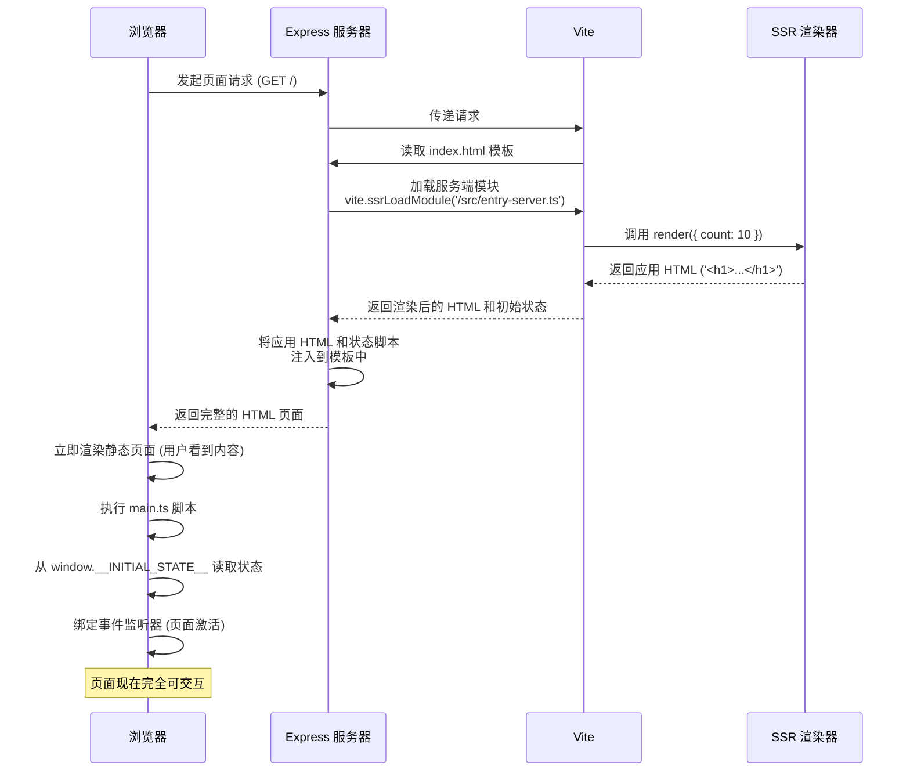

> This article was translated by AI and has not been manually reviewed.

## Toward Client-Side Rendering

Server-Side Rendering (SSR) is an application model in which the server renders a page into complete HTML and sends it directly to the client. This contrasts sharply with Client-Side Rendering (CSR), which usually sends only a minimal HTML skeleton and relies on JavaScript executed in the browser to render most of the content.

Web standards were originally born for documents. Later, to avoid notifying the server for every trivial matter, JavaScript gave clients programming capabilities. As requirements kept expanding, the JavaScript standard also continued to evolve, gradually gaining full network request and DOM manipulation capabilities.

This gave rise to an extremely imaginative approach: AJAX. Since all DOM nodes can be created by JavaScript on the client, a web page can contain only an HTML "template," then fetch data through AJAX requests and dynamically fill the data into the DOM with JavaScript.

AJAX's greatest contribution was bringing complete frontend-backend separation to the field of Web applications. From then on, frontend code no longer mixed with backend logic. The Web frontend evolved into a pure "data consumer," interacting with the backend through unified APIs. jQuery pushed this AJAX model to its peak.

Then modern frameworks such as React and Vue appeared. To reduce the pain of manually operating the DOM, they took over DOM manipulation comprehensively. To make it easier for frameworks to modify the DOM, it became simpler to let the framework create all DOM at the beginning. We only need to use a JavaScript data structure to represent the HTML template for the framework. Thus came JSX and Vue Single File Components.

This caused less and less HTML content to be sent directly to the browser. Eventually, the HTML of many pages was simplified to this:

```html
<html>
  <body>
    <div id="root"></div>
    <script type="module" src="/src/index.ts"></script>
  </body>
</html>
```

All DOM nodes wait for JavaScript to be downloaded, parsed, and executed before they can be filled and rendered. This is what we now call **Client-Side Rendering (CSR)**. Obviously, CSR inevitably brings some small problems, such as **longer first-screen rendering time**, because the DOM only appears after JavaScript has finished loading; and worse SEO, although search engines can now partially crawl JavaScript-rendered page content.

To solve these problems without breaking the existing CSR system and the advantages it brings, an even more magical approach appeared: **Server-Side Rendering (SSR)**.

## Detailed SSR Workflow

We can divide it into two main stages: **server processing** and **client hydration**. Server processing is implemented with Vite and Express, and client hydration is implemented with Vite.

### 1. Receiving Requests and Preparing the Template

When a user visits the website, the process begins:

1.  **Server startup**: Create an Express application instance to listen for all incoming requests.
2.  **Vite middleware**: Vite is integrated into Express in middleware mode (`middlewareMode: true`). It handles on-demand module loading, hot updates in development, and most importantly, code transformation.
3.  **Read the HTML template**: For each request, the server first reads the contents of the `index.html` file. This file is a "template" with two placeholders:

    ```html
    <!-- index.html -->
    <body>
      <div id="app"><!--ssr-outlet--></div>
      <!--ssr-state-->
      <script type="module" src="/src/main.ts"></script>
    </body>
    ```

    -   `<!--ssr-outlet-->`: This location will be replaced by the dynamic application content rendered by the server.
    -   `<!--ssr-state-->`: This location is used to inject the application's initial state so the client can take over. All initial "state" values, meaning some data, are represented as a JavaScript object and attached directly to the `window` object.

### 2. Server-Side Rendering

After obtaining the template, the server needs to generate dynamic content to fill the placeholders:

1.  **Load the server entry module**: Vite's `vite.ssrLoadModule('/src/entry-server.ts')` executes the `entry-server.ts` file in the server environment. This is isolated from executing scripts in the browser.

2.  **Generate application HTML**:
    -   `entry-server.ts` calls the `render` function.
    -   The `render` function receives an **initial state**, `{ count: 10 }` in this example, and calls the `createApp` function.
    -   The `createApp` function in `app.ts` generates a pure HTML string for the application based on this initial state.

    ```typescript
    // src/app.ts
    export function createApp(initialState: { count: number }) {
      return `
        <h1>Hello, SSR!</h1>
        <p>This is a simple counter.</p>
        <div id="counter">Count: ${initialState.count}</div>
        <button id="increment">Increment</button>
      `;
    }
    ```

    At this point, we have obtained `appHtml`, whose content is an HTML fragment containing `Count: 10`.

### 3. State Injection and HTML Assembly

To let the client-side JS know the initial state used when the application was rendered on the server, the server needs to pass this state down. The server serializes the initial state object `{ count: 10 }` into a string, embeds the serialized state into a `<script>` tag, and mounts it on the `window` object.

```javascript
// server.ts
const stateHtml = `<script>window.__INITIAL_STATE__ = {"count":10}</script>`;
```

The server uses the `appHtml` and `stateHtml` generated in the previous step to replace the `<!--ssr-outlet-->` and `<!--ssr-state-->` placeholders in the `index.html` template respectively.

```javascript
// server.ts
const html = template
    .replace(`<!--ssr-outlet-->`, appHtml)
    .replace(`<!--ssr-state-->`, stateHtml);
```

Finally, the server sends the browser a complete HTML page containing all content.

### 4. Hydration

After receiving the complete HTML, the browser displays it immediately. But at this point the page is only static; interactions such as button clicks do not work. To make the page "alive," client-side JavaScript must step in: **Hydration**.

1.  **Execute the client script**: After parsing the HTML, the browser executes `<script type="module" src="/src/main.ts"></script>`. Obviously the browser cannot execute TypeScript code directly, so Vite handles the transformation here.
2.  **Get the initial state**: The code in `main.ts` first reads the state injected by the server from `window.__INITIAL_STATE__`, so the client's initial state remains consistent with the server's.

    ```typescript
    // src/main.ts
    let count = window.__INITIAL_STATE__.count; // count is 10
    ```

3.  **Bind event listeners**: The script obtains DOM elements, such as the button, and binds event listeners to them.

    ```typescript
    // src/main.ts
    incrementButton.addEventListener('click', () => {
        count++;
        counterElement.textContent = `Count: ${count}`;
    });
    ```

At this point, the page has effectively been "taken over" by client-side JavaScript. It is now no different from CSR, and all later interactions can be handled by client-side JavaScript. Page navigation can be fake navigation, and form submissions can also use AJAX without refreshing the page.

## Flowchart


