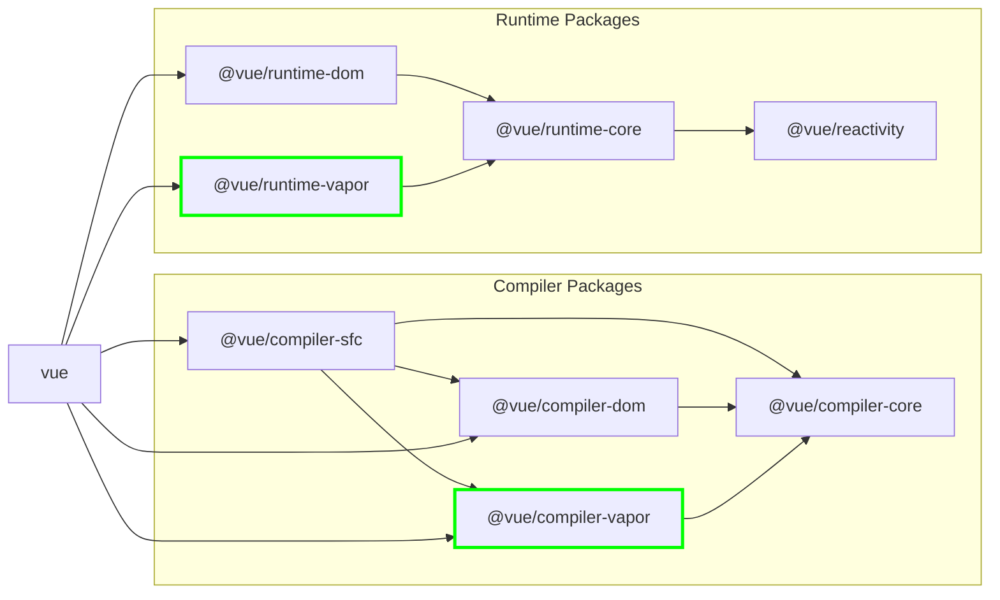

> This article was translated by AI and has not been manually reviewed.

## Virtual DOM

Evan You announced Vue 3.6-alpha at VueConf 2025 in Shenzhen on July 12, 2025.

This is common knowledge: the most efficient JavaScript framework in the world is vanilla-js (laughs). Native DOM operations are the most efficient from an overhead perspective, but the reason we no longer even want to write jQuery is that directly manipulating the DOM creates too much mental burden. After getting used to frameworks, writing native DOM operations feels like writing Python every day and then suddenly being asked to build wheels from the bottom up in C++.

Is it possible to let the compiler generate efficient, directly targeted DOM operation code without changing the existing way of writing Vue framework code, meaning without changing the API for framework users? After all, Svelte and Solid.js have already provided plenty of experience on this path.

## Vapor Mode

The **Vapor Mode** introduced in Vue 3.6 is essentially a brand-new compiled rendering strategy. It borrows ideas from Solid.js and directly generates code that operates on the real DOM at compile time, bypassing the Virtual DOM and diff process. Vapor Mode is a subset of existing Vue features and only supports the Composition API and components defined with Vue SFC.

In addition, it does not yet support features such as `<Transition>`, `<KeepAlive>`, and SSR, so obviously Nuxt cannot use it right now. However, these features will be gradually supported during the alpha -> beta phase.

The following is a demo diagram from Evan You's [VueConf 2025 keynote](https://www.bilibili.com/video/BV1fyu9zsEAf/):



### a. Template Compilation and Real DOM Cloning

During compilation, Vapor Mode converts the component's HTML template into a "factory function." At the core of this function is a `<template>` element containing the component's static HTML structure. For example:

```vue
<script setup vapor>
import { ref } from 'vue'
const count = ref(0)
</script>

<template>
  <button @click="count++">
    Count: {{ count }}
  </button>
</template>
```

For the single-file component above, Vapor Mode generates code like this:

```javascript
// 编译产物中的模板函数
const t0 = template("<div><h1>Hello World</h1><button> </button></div>");

// template() 函数内部大致实现
let t;
function template(html) {
  let node;
  return () => {
    if (!node) {
      t = t || document.createElement("template");
      t.innerHTML = html;
      node = child(t.content); // 获取template内的第一个真实节点
    }
    // 每次调用都克隆真实DOM节点
    return node.cloneNode(true);
  };
}
```

When the component is rendered, this factory function is called, creating a real DOM structure through `cloneNode(true)`.

### b. Precise DOM Node Navigation

The compiler analyzes the template structure and generates direct, precise code to locate the DOM nodes that need dynamic updates.

```javascript
// 获取对特定DOM节点的引用
const n1 = t0(); // n1 是 <div>
const n0 = next(child(n1)); // n0 是 <button>
const x0 = child(n0); // x0 是 <button> 内部的文本节点
```

This avoids tree traversal and lookup at runtime. All paths are already determined at compile time.

### c. Direct Binding Between Reactivity and Rendering

Vapor Mode uses `renderEffect` to directly bind reactive data changes to concrete DOM update operations.

```javascript
const count = ref(0);

// 当 count.value 变化时，只执行 setText 更新文本节点
renderEffect(() => setText(x0, "Count is " + toDisplayString(count.value)));

// setText 直接操作DOM
function setText(el, value) {
  if (el.$txt !== value) {
    el.nodeValue = el.$txt = value;
  }
}
```

The callback of `renderEffect` only executes when the dependent reactive data changes. The compiler ensures that this callback is "minimized" and contains only the necessary DOM operations.

### d. Efficient Event Handling

Event Delegation is used to optimize event listening. Event listeners are added at the `document` level rather than on every element, reducing memory usage and the overhead of setting up events.

```javascript
delegateEvents("click"); // 在document上监听click事件
n0.$evtclick = () => count.value++; // 在DOM节点上附加一个属性来存储处理器
```

When an event is triggered, the global `delegatedEventHandler` finds the corresponding element and its handler based on the event path and executes it.

## Enabling Vapor

For now, you only need to add the `vapor` attribute to the SFC's `<script setup>` tag, turning it into `<script setup vapor>`, and the compiler will compile it in Vapor Mode.
