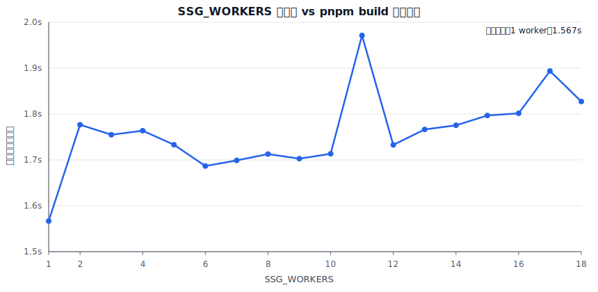

# 构建性能优化记录

本文档记录 Garden 的 Rsbuild + React SSG 构建链路中已经识别出的性能风险点，以及后续可以继续推进的优化方向。

## 构建命令拆分

站点构建不应该每次都重新构建本地内容编译器包。

当前约定命令：

```bash
# 只构建站点。CI / 线上构建环境中，内容编译器应来自已安装的 npm 依赖。
pnpm build

# 显式重新构建本地内容编译器。仅在开发 compiler 自身时需要。
pnpm run build:compiler

# 本地完整验证：先构建 compiler，再构建站点。
pnpm run build:all
```

拆分原因：

- 未来内容编译器单独发 npm 包，CI / 线上环境直接安装依赖即可。
- 只有修改 `crates/content-compiler` 或 `packages/content-compiler-napi` 时，才需要重新构建本地 compiler。
- 普通站点构建跳过 compiler rebuild，可以去掉一段固定的启动和构建成本。

## Benchmark 记录

基准命令统一为：

```bash
pnpm build
```

本轮测试环境：本机开发环境，内容编译缓存命中；当前 `pnpm build` 只构建站点，不再串行执行 `pnpm run build:compiler`。

### Step1 前：内容 API 仍重复排序 / 筛选 / 统计

| 轮次 | 耗时（秒） | 退出码 |
| --- | ---: | ---: |
| 1 | 1.961 | 0 |
| 2 | 1.663 | 0 |
| 3 | 1.742 | 0 |
| 4 | 1.577 | 0 |
| 5 | 1.547 | 0 |
| 6 | 1.563 | 0 |
| 7 | 1.601 | 0 |
| 8 | 1.592 | 0 |
| 9 | 1.646 | 0 |
| 10 | 1.566 | 0 |

汇总：min 1.547s，median 1.597s，mean 1.646s，max 1.961s。

### Step1 后：TS 侧内容 API 改为模块级预计算索引

| 轮次 | 耗时（秒） | 退出码 |
| --- | ---: | ---: |
| 1 | 1.572 | 0 |
| 2 | 1.532 | 0 |
| 3 | 1.593 | 0 |
| 4 | 1.618 | 0 |
| 5 | 1.575 | 0 |
| 6 | 1.686 | 0 |
| 7 | 1.617 | 0 |
| 8 | 1.616 | 0 |
| 9 | 1.550 | 0 |
| 10 | 1.568 | 0 |

汇总：min 1.532s，median 1.575s，mean 1.593s，max 1.686s。

### 对比

| 指标 | Step1 前 | Step1 后 | 变化 |
| --- | ---: | ---: | ---: |
| min | 1.547s | 1.532s | -0.015s |
| median | 1.597s | 1.575s | -0.022s |
| mean | 1.646s | 1.593s | -0.053s |
| max | 1.961s | 1.686s | -0.275s |

当前文章量只有 39 篇，`pnpm build` 总耗时中还包含 Rsbuild、SSG bundle 启动、React 渲染和文件写入，所以 Step1 对总耗时的绝对改善不大；但它把 SSG 期间多处 O(P * N log N) / O(P * N) 的重复工作收敛为模块加载时一次 O(N) 建索引，随着文章数、标签页、归档页、分页数量增长，收益会放大。

## 后续优化点

### 1. 已完成：为内容 API 做预计算索引

`packages/site/src/lib/api.ts` 里很多函数会重复对文章列表进行排序、筛选和统计，例如：

- `getAllPosts`
- `getAllTags`
- `getAllMonths`
- `getPostsByTag`
- `getPostsByMonth`
- `getPostById`
- 各类分页 helper

当前文章数量较少，这些重复计算还不明显。但 SSG 会在生成很多页面时反复调用这些函数；随着文章数量增长，这部分会变成不必要的 CPU 开销。

建议方向：

- 在模块加载时一次性构建缓存索引：
  - 已排序的全部文章列表
  - 已排序的公开文章列表
  - `postById`
  - 公开文章的 id -> index 映射
  - tag -> posts 映射
  - month -> posts 映射
  - 预计算好的 tag 统计和 month 统计
- 对外导出的 API 函数改为读取这些缓存结构，而不是每次重新 sort / filter / map。

落地结果：

- `packages/site/src/lib/api.ts` 在模块加载时一次性建立 `postById`、公开文章 index、tag -> posts、month -> posts、全部文章 ID、tag 统计、month 统计。
- `getAllPosts`、`getAllTags`、`getAllMonths`、`getPostsByTag`、`getPostsByMonth`、`getPostById`、分页 helper 改为读取缓存结构。
- `getAllPosts` 现在用预计算数组覆盖 `includeDrafts` / `includeHidden` 的四种组合，默认公开 API 与注释一致：排除草稿和隐藏文章。
- 分页逻辑合并为一个通用 helper，避免三处重复计算和分支。
- 保持外部 API 返回数组副本，降低调用方意外修改缓存数组的风险。

### 2. 验证计划：为内容 API 优化补充回归检查

Step1 修改的是 SSG 关键路径上的基础 API，后续需要补充轻量但稳定的回归检查，确保继续优化时不破坏页面路径、导航关系和统计数据。

建议方向：

- 增加 API 层单测或脚本化断言：
  - `getAllPosts()` 默认只返回公开文章，并保持日期降序。
  - `getAllPostIds()` 仍包含所有生成文章，供隐藏文章策略和 sitemap 过滤逻辑复用。
  - `getPostById()` 对公开文章返回正确的 `prevPost` / `nextPost`，对草稿继续抛错。
  - `getAllTags()` / `getAllMonths()` 的计数与公开文章集合一致。
  - tag / month 分页的 `totalPosts`、`totalPages`、`currentPage` 与边界页码行为稳定。
- 增加一次静态路径快照检查：基于 `getStaticPathnames()` 输出排序后的路径列表，避免标签 URL、月份归档 URL、分页 URL 被误删。
- 将 benchmark 脚本固化成单独命令，例如 `pnpm bench:build`，输出 JSON 和 markdown table，避免手动记录误差。
- 在新增大量文章或调整内容生成 schema 时，先跑 API 回归检查，再看构建耗时变化。

### 3. 后续方向：把索引生成前移到内容生成阶段 / Rust 侧

TS 侧预计算已经避免 SSG 多页面重复调用时的重复排序、筛选和统计；下一步可以把更 CPU-heavy、与内容生成强相关的工作继续前移到内容编译器输出阶段。

建议方向：

- Rust 内容编译器直接输出稳定的内容索引模块，例如：
  - `allPostIds`
  - `publicPostIds`
  - `postById` 的轻量索引数据
  - `tag -> post ids`
  - `month -> post ids`
  - tag 统计和 month 统计
- TS API 层只负责把索引 id 映射回当前需要的 post 对象，避免 Node SSG 阶段重复构建 Map。
- 将全文搜索索引、摘要、lowercase 搜索字段等字符串预处理尽量放在内容生成阶段，减少运行时 `toLowerCase()`、split 和 substring 的重复成本。
- 保持 Rust 输出的 schema version；当索引结构变化时，让缓存严格失效。
- 需要注意：Rust 侧预计算应优先输出 JSON / TS 常量，不要让站点构建重新触发本地 Rust 编译；CI / 线上环境仍应依赖已发布 npm 包。

### 4. 提升 SSG 渲染扩展性

`packages/site/src/ssg/build.ts` 当前会生成所有静态路径，并在一个 Node 进程里渲染全部页面。虽然代码里使用了 `Promise.all`，但 React 的 `renderToString` 是同步 CPU 工作，所以页面渲染本身基本仍然是单进程同步执行。

建议方向：

- 页面数量较小时继续保持当前简单实现。
- 当页面数量明显增加后，可以考虑用 worker threads 或 child processes 分片渲染 pathnames。
- 如果未来只修改少量文章，可以进一步考虑增量 SSG，只重建受影响页面。

### 5. 让 SSG 脚本可重复执行

当前 SSG 脚本读取 `dist/index.html` 作为模板，同时又会把首页 `/` 写回 `dist/index.html`。第一次 SSG 后，模板里的 root marker 已经被替换掉；如果不重新跑 Rsbuild，直接再次执行 SSG，会找不到 root marker 并失败。

建议方向：

- 保留一个独立模板文件，例如 `dist/__template.html`；或
- 从不会被 SSG 覆盖的稳定位置读取模板。

这不是当前主要耗时点，但会影响单独调试 SSG、做 profiling，以及未来实现增量 SSG。

### 6. 分析并减少较大的 web chunks

当前 web 构建产物里有一些较大的 async chunk。可能的主要来源包括：

- `mermaid`
- `react-syntax-highlighter`
- `katex`
- Markdown / math / code 渲染相关依赖

建议方向：

- 为 Rsbuild / Rspack 增加 bundle analyzer。
- 继续保持 Mermaid 客户端懒加载。
- 代码高亮语言按需加载，不要一次性注册大量语言。
- 检查 lockfile / 依赖图里是否存在重复 KaTeX 版本，并尽量 dedupe。

### 7. 内容增长后重新评估 generated post module 形态

当前内容编译器会把每篇文章输出成一个 TypeScript module，里面包含完整 Markdown 正文。这个方案简单直观，当前规模下也没问题；但内容量上来后，Rsbuild 需要解析更多生成源码，模块图也会更重。

建议方向：

- 元数据和索引继续保留在 TypeScript module 中。
- 完整 Markdown 正文可以改成 JSON 或 raw static asset。
- SSG 阶段按 slug 读取正文。
- 客户端文章页只懒加载当前 slug 对应的正文。

### 8. 保持内容编译缓存的严格失效规则

当前内容编译缓存效果不错，后续演进时需要继续保持正确性：

- cache key 应包含源文件内容 hash。
- cache key 应包含 compiler version 和生成产物 schema version。
- CI / release 构建不要只依赖 mtime 做缓存正确性判断。
- 不要在不同信任边界之间共享不可信 CI cache。

## SSG Worker 并发实验

### 改造内容

为后续真正并行渲染 SSG 页面，先把 `packages/site/src/ssg/build.ts` 中可并行的单页渲染 / 写文件逻辑拆到了 `packages/site/src/ssg/render-page.ts`：

- `renderStaticPage(template, pathname)`：只负责把单个 pathname 渲染成最终 HTML 字符串。
- `writeStaticPage(distDir, template, pathname)`：负责单页 HTML 输出路径计算、目录创建和写文件。
- `build.ts` 保留全局 orchestration：读取模板、生成静态路径、分片、启动 worker、复制搜索索引、写 robots 和 sitemap。

并新增 `SSG_WORKERS` 环境变量：

```bash
# 默认：保持原来的单进程行为，避免小站点被 worker 启动成本拖慢
pnpm build

# 显式使用 N 个 worker 并发渲染 SSG 页面
SSG_WORKERS=6 pnpm build

# 自动模式：按页面数和 os.availableParallelism() 估算
SSG_WORKERS=auto pnpm build
```

实现上没有让 Rsbuild 额外打一个独立 worker entry，而是让 `.rsbuild/ssg/build.js` 同时支持 main thread 和 worker thread 两种模式：main thread 负责构建编排，worker thread 只处理自己分到的 pathnames。这样可以避开 `new URL('./worker.ts', import.meta.url)` 被 Rspack 当成普通 asset 后，Node 运行时无法解析 worker 内部相对 import 的问题。

### Benchmark 方法

本轮实验命令：

```bash
SSG_WORKERS=<1..18> pnpm build
```

每个 worker 数运行 10 次，记录完整 `pnpm build` wall time 并取平均。注意：这里测的是完整站点构建，包含 Rsbuild web/ssg bundle、内容编译缓存命中检查、Node SSG 启动、页面渲染和文件写入；因此 worker 并发只作用在其中的 SSG 页面渲染 / 写文件阶段，收益会被 Rsbuild 等固定成本稀释。

### 结果



| SSG_WORKERS | 平均耗时 | 中位数 | 最小值 | 最大值 |
| ---: | ---: | ---: | ---: | ---: |
| 1 | 1.567s | 1.544s | 1.509s | 1.667s |
| 2 | 1.777s | 1.779s | 1.722s | 1.832s |
| 3 | 1.755s | 1.750s | 1.697s | 1.838s |
| 4 | 1.764s | 1.768s | 1.691s | 1.850s |
| 5 | 1.733s | 1.718s | 1.676s | 1.854s |
| 6 | 1.687s | 1.679s | 1.664s | 1.726s |
| 7 | 1.699s | 1.698s | 1.675s | 1.719s |
| 8 | 1.713s | 1.705s | 1.672s | 1.787s |
| 9 | 1.703s | 1.697s | 1.667s | 1.749s |
| 10 | 1.713s | 1.701s | 1.677s | 1.772s |
| 11 | 1.971s | 1.811s | 1.688s | 2.618s |
| 12 | 1.733s | 1.736s | 1.693s | 1.787s |
| 13 | 1.766s | 1.747s | 1.690s | 1.917s |
| 14 | 1.775s | 1.778s | 1.732s | 1.830s |
| 15 | 1.797s | 1.789s | 1.753s | 1.853s |
| 16 | 1.802s | 1.794s | 1.763s | 1.854s |
| 17 | 1.894s | 1.898s | 1.788s | 1.969s |
| 18 | 1.827s | 1.831s | 1.793s | 1.858s |

### 结论

当前内容规模下，`SSG_WORKERS=1` 仍然最快：平均 1.567s。显式开启 worker 后，最好的一组是 6 workers，平均 1.687s，比单进程慢约 0.120s。原因主要是：

- 现在只有 131 个静态页面，单页 React SSR 工作量不大。
- 每个 worker 都要启动一个 V8 isolate，并加载 `.rsbuild/ssg/build.js` 及 React / 路由 / 内容模块，固定成本较高。
- 完整 `pnpm build` 中 Rsbuild 编译和内容缓存检查占了明显固定成本，worker 只能优化 SSG 渲染阶段的一部分。
- 高并发时还会增加模块加载、GC、文件写入调度和 CPU cache 抖动，18 个逻辑核并不意味着当前任务适合开 18 个 worker。

因此当前默认仍保持 1 worker。`SSG_WORKERS=auto` 也按页面数保守估算，目前 131 个页面会得到 1；等页面数量上来后再自动放开。显式 `SSG_WORKERS=N` 保留给 profiling 和大规模内容实验使用。
