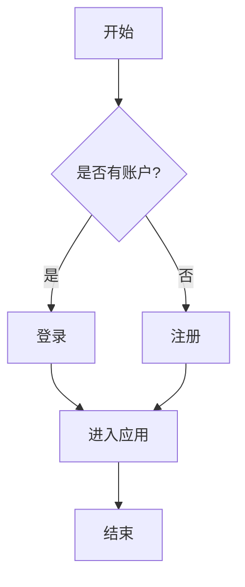
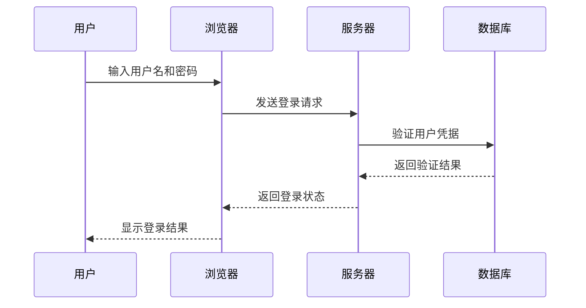
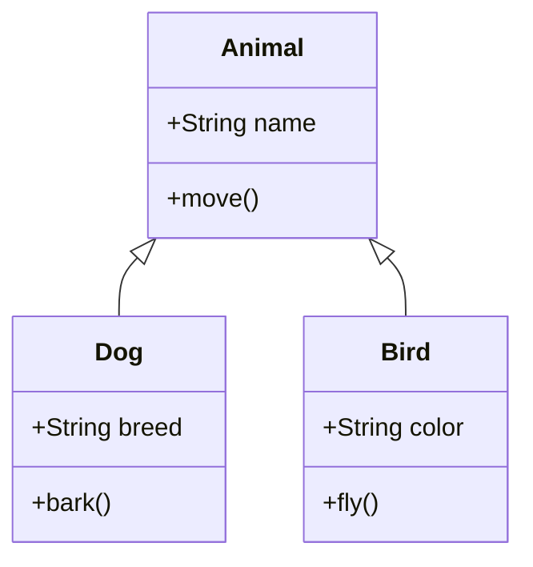
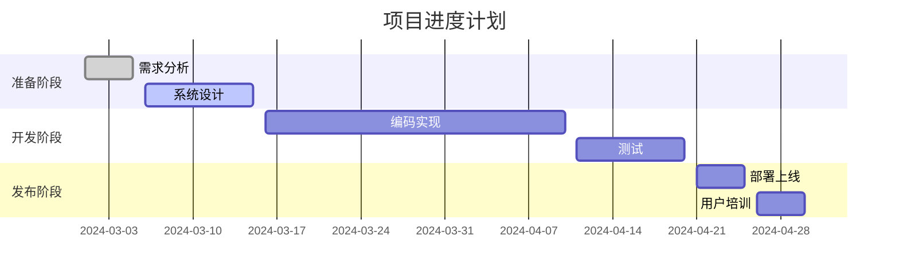

# Mermaid 图表测试

这篇文章展示了如何在 Markdown 中使用 Mermaid 图表，并通过服务端渲染在 Next.js 中展示它们。

## 流程图示例

下面是一个简单的流程图示例：

## 时序图示例

下面是一个时序图示例，展示了用户与系统的交互：

## 类图示例

下面是一个简单的类图示例：

## 甘特图示例

下面是一个甘特图示例，展示了项目进度：

## 使用注意事项

1. Mermaid 图表需要包含在 \`\`\`mermaid 代码块中
2. 图表语法需要符合 Mermaid 规范
3. 复杂图表可能需要额外的配置

希望这些示例对你有所帮助！ 