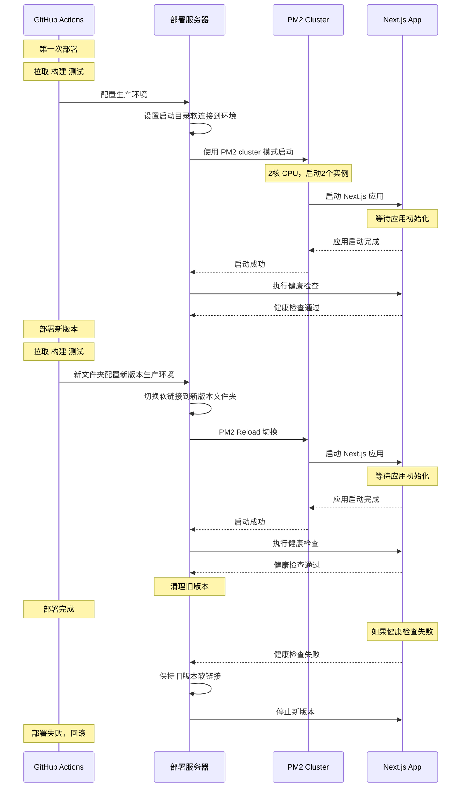

## 蓝绿部署

**蓝绿部署**是一种零停机部署策略，其核心思想是维护两套完全相同的环境：一套运行当前版本（所谓蓝色环境），另一套部署新版本（所谓绿色环境）。当新版本部署完成并验证无误后，将用户请求从蓝色环境平滑切换到绿色环境，从而实现零停机部署。

这个**平滑切换**就很玄学了。对于 Node.js 支持的应用，常见 PM2 工具部署。PM2 的 **Cluster 模式** 允许创建 Node.js 应用的多个进程，分布在多个 CPU 内核执行（如果你的服务器是多核的话），实现一定程度上的并发和对 CPU 的负载均衡。

**`pm2 reload`** 会在不中断服务的情况下，逐个重启 Cluster 模式下的进程。当 PM2 开始重启时，它会先启动一个新的进程，等待新进程完全启动并正常运行后，才会优雅地关闭旧进程。这样，在重启过程中，始终有进程在提供服务，从而实现零停机更新。

那怎么以最快速度更改掉生产环境的代码呢？**软链接**是个好东西。PM2 部署时，给 PM2 的应用指向当前运行版本的软链接（如 `current` -> `releases/oldVersion`），而不是直接用固定的目录。当需要部署新版本时，我们先将新版本部署到一个新目录（如 `releases/newVersion`），然后通过更新软链接指向，实现瞬间切换。这种方式的优势在于切换过程是原子操作，几乎没有停机时间，且如果新版本出现问题，可以立即将软链接指回旧版本，回滚也很容易。不过还有一个小坑，Node.js 会自作聪明把软链接解析了去，添加 `--preserve-symlinks` 参数可以避免这一问题。翻 Node.js [`preserve-symlinks`相关文档](https://nodejs.org/api/cli.html#cli_preserve_symlinks) 才翻出来原因。

目录名用部署时的时间戳，可以省去判断新旧环境的劳神费力。按当下时间创文件夹怎么都不会跟前面的冲突。

对于生产环境还会产生文件的应用（用户上传内容之类的），可以在应用根目录下创建一个文件夹用来共享。每次部署新版本时，共享目录的数据不跟着版本控制一块切换。

```dir
/APP_ROOT
├── shared  # 共享数据
├── current -> releases/release-20250320-140000/  # 软连接
└── releases/
    ├── release-20250320-140000/  # 旧版本
    └── release-20250325-153030/  # 新版本
```

```bash
# 原子操作切换符号链接
ln -sfn "$RELEASE_DIR" "$CURRENT_LINK.new"
mv -T "$CURRENT_LINK.new" "$CURRENT_LINK"
```

更新后再`pm2 reload`，**似乎**我们的零停机部署就这样设计好了。似乎？理论上这样没问题对吧（）

## PM2 Cluster 模式下的 Next.js 部署

只要在 `ecosystem.config.js` 里设置 `instances: 2` 就能让 Next.js 应用在双核服务器上跑两个实例？是我天真了。不过如上部署之后 GitHub Actions 显示跑通，页面也能正常打开，似乎真的一切顺利——还好我看了一眼 PM2 的日志，好家伙，永远只有一个实例在正常工作，另一个实例高频异常重启。

一开始我还以为是 PM2 的两个实例不能监听同一个端口，需要我自己在反代的 Caddy 或者 Nginx 配置负载均衡。后来各种查资料才发现错怪 PM2 了——多实例监听同端口自动负载均衡是 PM2 的核心功能之一（批评 PM2 的官方文档。简略的像新手指引）。问题出在 Next.js 。

Next.js 的 `pnpm start` 命令多实例部署会冲突。那那那，那怎么办。一通百度搜索，使用 `standalone` 模式编译可以解决这个问题：

```json
{
  "scripts": {
    "build": "next build --standalone"
  }
}
```

`standalone` 模式下编译，Next.js 会提供一个包含独立服务器（可以用 `server.js` 启动）的产物。这样构建出来的产物可以直接用 `node .next/standalone/server.js` 启动服务，PM2 就可以正常启动多份了。

```shell
# 如果应用不存在，则首次启动
if ! pm2 list | grep -q "app"; then
  echo "首次启动应用..."
  NODE_OPTIONS="--preserve-symlinks" pm2 start server.js \
    --name app \
    -i 2 \
    --time \
    --max-memory-restart 768M \
    --kill-timeout 5000 \
    --no-autorestart \
    --no-watch \
    --env production \
    --update-env \
    --cwd "$CURRENT_LINK"
else
  echo "平滑重载应用..."
  NODE_OPTIONS="--preserve-symlinks" pm2 reload app \
    --update-env \
    --max-memory-restart 768M \
    --kill-timeout 5000 \
    --restart-delay=5000
fi
```

## 静态资源丢失与 Next.js 构建方式

本以为问题解决了，结果网站前端出现了 JS、CSS 无法正常显示的问题。各种排查终于发现问题的根源：自动构建结果 `.next/standalone` 目录其实是个独立的项目，它并不依赖父层级中 `.next` 文件夹中的其它产物，事实上，它自己内部有一个独立的 `.next` 文件夹（是的，`./.next/standalone/.next`，不知道谁设计的）。所以需要需要把外面的 `static` 文件夹拷贝到 `standalone` 里。默认构建结果 `.next/static` 和 `.next/standalone` 是平级的，层级关系错了所以一直有问题。正确的目录结构应该是：

```dir
.next/
├── standalone/
│   ├── .next
│   ├── src      # .md原始文件，SSR渲染用
│   ├── server.js
│   ├── package.json
│   └── static/  # 需要把 static 文件夹拷贝到这里
└── static/      # 原始静态资源
```

既然 `standalone/` 可以当一个独立项目用，外面的就不需要了。不过这一层没有 `pnpm-lock.yaml` 文件，从最外层拷贝一份进来。这样子，部署脚本需要好好的重新考虑哪些文件是必要的了。

至于发现问题所在之后，如何知道正确的配置方式——表扬 Next.js 的文档。主要参考了[Next.js 的构建产物文档](https://nextjs.org/docs/app/api-reference/config/next-config-js/output)。

```shell
mkdir -p deploy

cp -r .next/standalone/.next deploy/
cp -r .next/standalone/src deploy/
cp -r .next/standalone/package.json deploy/
cp -r .next/static deploy/.next/

cp .next/standalone/server.js deploy/
cp pnpm-lock.yaml deploy/
cp ecosystem.config.js deploy/

echo "部署目录总大小："
du -sh deploy/
```

这样修改后，Next.js 应用就能正常加载静态资源了。


