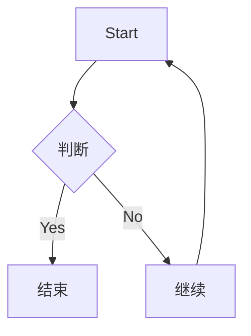
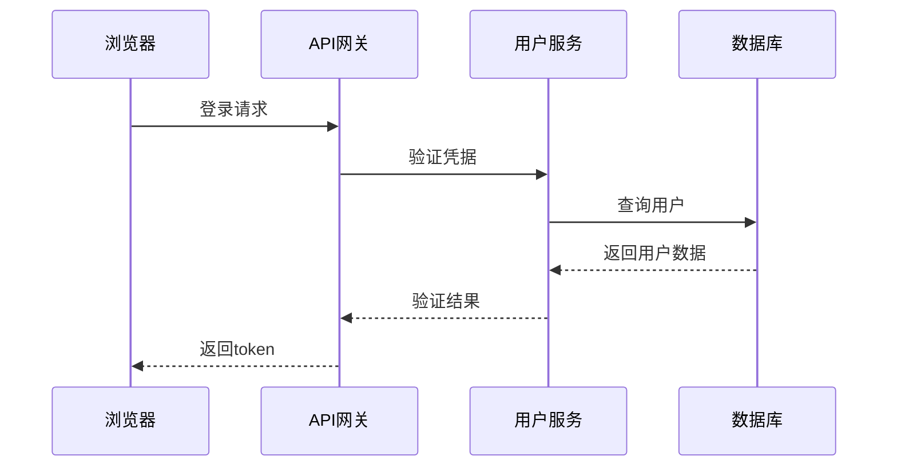
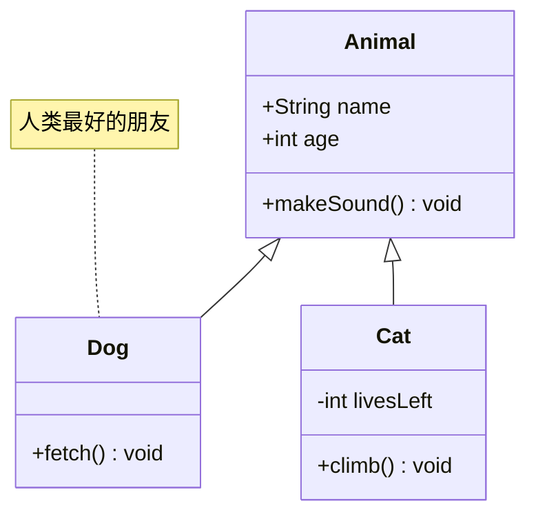
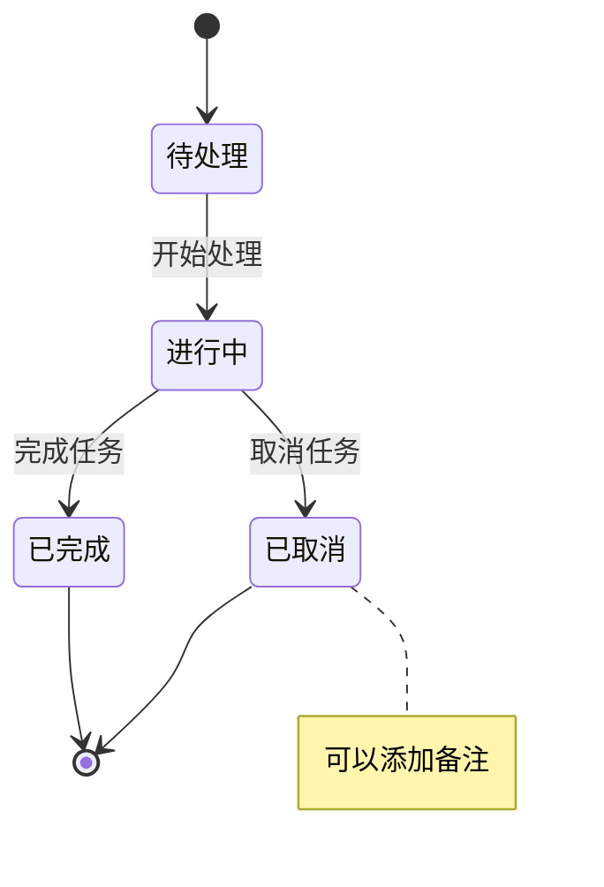
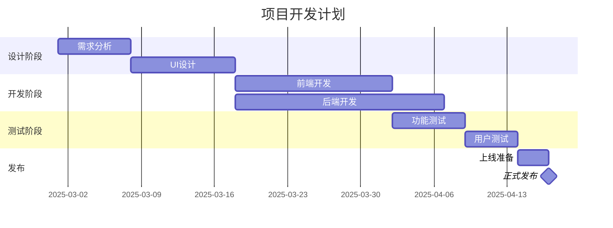
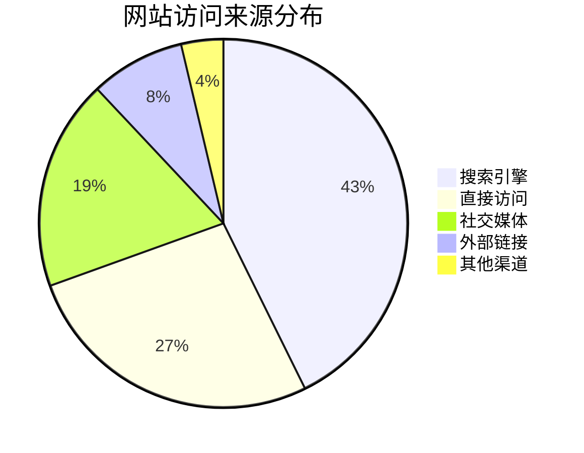

Mermaid 不是画图神器，它的可 diy 程度很差劲，样式也很单调。如果是画比较复杂的图表，几乎毫无疑问你最好去用 [draw.io](https://draw.io/) 之类的工具。但是鉴于我个人只要不是特别正式的文档都已经变成 Markdown 了，在写文档的时候需要顺手画一些简单的示意图，这时候再去调专业的画图工具，就不免会想，为啥图表不能像数学公式一样，有个 LaTeX 一样的纯键盘可嵌入 Markdown 的解决方案呢？

——方案就是 Mermaid。

按照惯例，先来一个 Mermaid 界的 Hello World 试试：

```mermaid_code
graph TD
    A[Start] --> B{判断}
    B -->|Yes| C[结束]
    B -->|No| D[继续]
    D --> A
```



这是最简单的流程图了。这玩意儿会让你感觉有点像写 HTML 时的心情——语法看起来也不是特别直观嘛，咋还跟 Markdown 相提并论上了捏。但是图表这种东西，用键盘去输入，把二维图表展开成一维的字符串——也许和 LaTeX 的直观度差不了多少。LaTeX 用熟了不也适应了。

不过 Mermaid 的语法其实挺符合画图过程的直觉的，符合「一张图被构建出来的流程」。

先声明图表类型（`graph`），然后定义节点方向（`TD` 表示 top-down，自上而下），接着就是定义节点和它们之间的连接关系。方括号 `[]` 代表矩形节点，花括号 `{}` 代表菱形判断节点，箭头 `-->` 表示连接。

Mermaid 支持的图表种类：

- 流程图（Flowchart）：程序逻辑或工作流程
- 时序图（Sequence Diagram）：对象之间的交互
- 类图（Class Diagram）：面向对象设计
- 状态图（State Diagram）：状态转换
- 甘特图（Gantt）：项目管理
- 饼图（Pie Chart）：数据可视化

装专业的**时序图**：

```mermaid_code
sequenceDiagram
    participant 浏览器
    participant API网关
    participant 用户服务
    participant 数据库
    
    浏览器->>API网关: 登录请求
    API网关->>用户服务: 验证凭据
    用户服务->>数据库: 查询用户
    数据库-->>用户服务: 返回用户数据
    用户服务-->>API网关: 验证结果
    API网关-->>浏览器: 返回token
```



这么一看，整个请求流程一目了然。关于**类图**、**状态图**、**甘特图**、**饼图**，我各放了一个例子在文章的最后。

有几个常见的小小问题。在流程图里，

```mermaid_code
graph LR
    A[这是A] --> B[这是B]
```


这里的 `A` 和 `B` 是节点 ID，而方括号里的才是显示文本。如果你写成了：

```mermaid_code
graph LR
    这是A --> 这是B
```


Mermaid 会把整个文本当作 ID，并且原样显示。这在简单图表里影响不大，但在复杂图表里就容易混乱。

第二个是样式问题。默认的 Mermaid 图表...emmm，说实话颜值一般。好在它支持自定义样式：

```mermaid_code
graph LR
    A[不美吗] --> B[还是不美]
    style A fill:#f9f,stroke:#333,stroke-width:4px
    style B fill:#bbf,stroke:#f66,stroke-width:2px,color:#fff
```


然后你会发现，用 CSS 调 Mermaid 样式，那我为啥不滚回去用 draw.io 呢？好吧，所以这个功能属实没有什么意义——如果你频繁的使用它，那你就背离了使用 Mermaid 的初衷。如果你真的受不了 Mermaid 的颜值那确实没有什么好办法，不过你可以自己动手实现一个高颜值的 Mermaid 解析器还能 diy 语法规则（

第三个问题是布局控制。Mermaid 的自动布局算法在简单图表上表现不错，但复杂图表可能会出现节点重叠或者连线交叉。有时候调整了半天代码，图表布局还是不如人意，这时候真的会怀念可视化工具的拖拽功能。所以我的建议是不要试图用 Mermaid 画过于复杂的图。

我觉得还是开头的话—— Mermaid 并不强大。但是架不住现在几乎所有主流的笔记和文档工具都支持 Mermaid，比如最流行的一些 Markdown 工具—— Typora 或者开源的 Obsidian ，都有原生的 Mermaid 支持。

对于用 Markdown 写成的技术文档中嵌入图标，Mermaid 绝对是首选。但如果是复杂的企业级架构图或者需要精细控制的设计图，可能还是专业绘图工具更合适。不过话说回来，Mermaid 的定位本来就不是要取代那些专业工具，而是提供一个简单、快速的图表生成方案。

## 附录：Mermaid图表示例大全

### 类图示例

```mermaid_code
classDiagram
    class Animal {
        +String name
        +int age
        +makeSound() void
    }
    class Dog {
        +fetch() void
    }
    class Cat {
        -int livesLeft
        +climb() void
    }
    Animal <|-- Dog
    Animal <|-- Cat
    note for Dog "人类最好的朋友"
```



类图特别适合展示面向对象设计和类之间的关系，对于写技术文档或讲解代码架构非常有用。

### 状态图示例

```mermaid_code
stateDiagram-v2
    [*] --> 待处理
    待处理 --> 进行中: 开始处理
    进行中 --> 已完成: 完成任务
    进行中 --> 已取消: 取消任务
    已完成 --> [*]
    已取消 --> [*]
    note right of 已取消: 可以添加备注
```



状态图可以清晰地表示系统或流程的不同状态及其转换关系。

### 甘特图示例

```mermaid_code
gantt
    title 项目开发计划
    dateFormat  YYYY-MM-DD
    section 设计阶段
    需求分析        :a1, 2025-03-01, 7d
    UI设计          :a2, after a1, 10d
    section 开发阶段
    前端开发        :a3, after a2, 15d
    后端开发        :a4, after a2, 20d
    section 测试阶段
    功能测试        :a5, after a3, 7d
    用户测试        :a6, after a5, 5d
    section 发布
    上线准备        :a7, after a6, 3d
    正式发布        :milestone, after a7, 0d
```



甘特图是项目管理的经典工具，可以直观地展示项目进度和各任务之间的依赖关系。不过有专业的团队协作工具还是直接从工具里截图吧，这个没必要 Mermaid 硬画。还是我所说——用 Mermaid 硬画过于复杂的图也是一种背离使用 Mermaid 的初心。

### 饼图示例

```mermaid_code
pie
    title 网站访问来源分布
    "搜索引擎" : 42.7
    "直接访问" : 26.8
    "社交媒体" : 18.5
    "外部链接" : 8.3
    "其他渠道" : 3.7
```



饼图的语法简单，直接写标题和数据就行，适合在文档中快速展示比例数据。