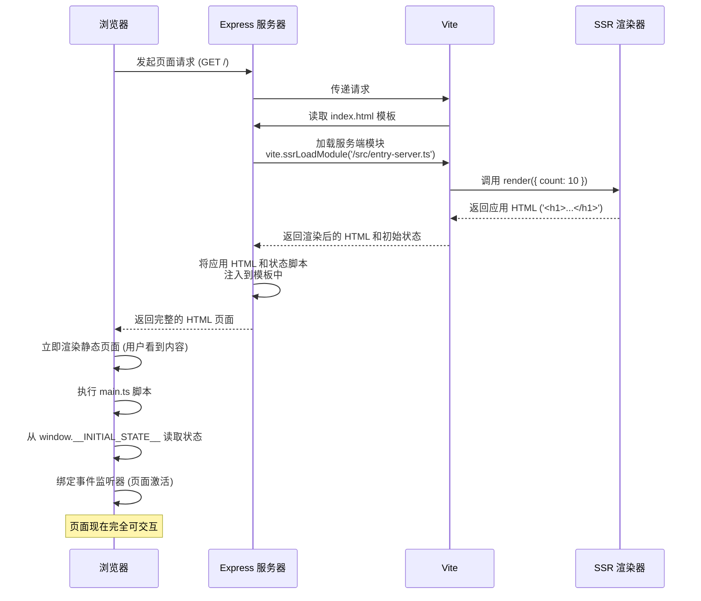

## 走向 Client-Side Rendering

服务器端渲染 (SSR) 是一种在服务器上将页面渲染成完整 HTML，然后将其直接发送到客户端的应用程序模型。这与客户端渲染 (CSR) 形成了鲜明对比，后者通常只发送一个最小的 HTML 骨架，大部分内容的渲染依赖于在浏览器中执行的 JavaScript。

Web 标准最早是为了文档而生的。后来为了避免大事小事都去通知服务器，便有了赋予客户端编程能力的 JavaScript。随着需求不断膨胀，JavaScript 标准也持续迭代，逐渐拥有了完整的网络请求和 DOM 操作能力。

这催生了一种极富想象力的方案——AJAX。既然所有 DOM 节点都可以由 JavaScript 在客户端创建，那么网页可以只包含一个 HTML “模板”，然后通过 AJAX 请求获取数据，再用 JavaScript 动态地将数据填充到 DOM 中。

AJAX 最大的贡献是带来了 Web 应用领域彻底的前后端分离。从此，前端代码不再与后端逻辑混杂，Web 前端演变成一个纯粹的“数据使用者”，通过统一的 API 与后端交互。jQuery 将这种 AJAX 模式推向巅峰。

随后，React、Vue 等现代框架的出现，为了减轻开发者手动操作 DOM 的痛苦，全方位接管了 DOM 操作。为了方便框架修改 DOM，干脆一开始的所有 DOM 都交给框架去创建好了，我们只需要用一种 JavaScript 数据结构给框架把 HTML 的模板表示好就行。于是有了 JSX，有了 Vue Single File Components。

这使得直接发送到浏览器的 HTML 内容越来越少，最终，许多页面的 HTML 简化成了这样：

```html
<html>
  <body>
    <div id="root"></div>
    <script type="module" src="/src/index.ts"></script>
  </body>
</html>
```

所有 DOM 节点都等待着 JavaScript 的下载、解析和执行，然后才能被填充和渲染。这现在被我们称作**客户端渲染 (Client-Side Rendering, CSR)**。很显然，CSR 一定会带来一些不大的问题，比如**首屏渲染时间延长**——因为 DOM 只在 JavaScript 被加载完成后才会出现；比如网站的 SEO 会变差（不过目前搜索引擎已经可以部分抓取 JavaScript 渲染的页面内容了）。

为了解决这些问题，解决的同时又不想破坏现有的 CSR 体系和它带来的优势，一种更加神奇的方案出现了——**服务端渲染（Server-Side Rendering, SSR）**。

## SSR 工作流程详解

我们可以将其分为两个主要阶段：**服务器处理** 和 **客户端激活 (Hydration)**。服务端处理使用 Vite 和 Express 实现，客户端激活使用 Vite 实现。

### 1. 接收请求与模板准备

当用户访问网站时，流程开始：

1.  **服务器启动**：创建一个 Express 应用实例，用于监听所有传入的请求。
2.  **Vite 中间件**: Vite 以中间件模式 (`middlewareMode: true`) 集成到 Express 中。它负责处理模块的按需加载、热更新（开发环境）以及最重要的——转换代码。
3.  **读取 HTML 模板**: 对于每个请求，服务器首先会读取 `index.html` 文件的内容。这个文件是一个“模板”，包括两处占位符——

    ```html
    <!-- index.html -->
    <body>
      <div id="app"><!--ssr-outlet--></div>
      <!--ssr-state-->
      <script type="module" src="/src/main.ts"></script>
    </body>
    ```

    -   `<!--ssr-outlet-->`: 这个位置将被服务器渲染出的动态应用内容所替换。
    -   `<!--ssr-state-->`: 这个位置将用于注入应用的初始状态，以便客户端可以接管。所有初始的“状态”（一些数据）用 JavaScript 对象表示，直接挂在 `window` 对象上。

### 2. 服务端渲染

服务器拿到模板后，需要生成动态内容来填充占位符：

1.  **加载服务器端入口模块**: Vite 的 `vite.ssrLoadModule('/src/entry-server.ts')` 会在服务器环境中执行 `entry-server.ts` 文件。这与在浏览器中执行脚本是隔离的。

2.  **生成应用 HTML**:
    -   `entry-server.ts` 调用了 `render` 函数。
    -   `render` 函数接收一个**初始状态** (在这个示例中是 `{ count: 10 }`)，并调用 `createApp` 函数。
    -   `app.ts` 中的 `createApp` 函数根据这个初始状态，生成了应用的纯 HTML 字符串。

    ```typescript
    // src/app.ts
    export function createApp(initialState: { count: number }) {
      return `
        <h1>Hello, SSR!</h1>
        <p>This is a simple counter.</p>
        <div id="counter">Count: ${initialState.count}</div>
        <button id="increment">Increment</button>
      `;
    }
    ```

    此时，我们就得到了 `appHtml`，其内容是包含 `Count: 10` 的 HTML 片段。

### 3. 状态注入与 HTML 组装

为了让客户端 JS 知道应用在服务器渲染时的初始状态，服务器需要将这个状态传递下去。服务器将初始状态对象 `{ count: 10 }` 序列化成字符串，将序列化后的状态嵌入到一个 `<script>` 标签中，并挂载到 `window` 对象上。

```javascript
// server.ts
const stateHtml = `<script>window.__INITIAL_STATE__ = {"count":10}</script>`;
```

服务器用上一步生成的 `appHtml` 和 `stateHtml` 分别替换掉 `index.html` 模板中的 `<!--ssr-outlet-->` 和 `<!--ssr-state-->` 占位符。

```javascript
// server.ts
const html = template
    .replace(`<!--ssr-outlet-->`, appHtml)
    .replace(`<!--ssr-state-->`, stateHtml);
```

最终，服务器向浏览器发送的是一个包含了所有内容的完整 HTML 页面。

### 4. 水合

浏览器接收到完整的 HTML 后，会立即将其显示出来。但此时的页面只是静态的，按钮点击等交互是无效的。要让页面“活”起来，就需要客户端 JavaScript 的介入——**水合 (Hydration)**。

1.  **执行客户端脚本**: 浏览器解析完 HTML 后，会执行 `<script type="module" src="/src/main.ts"></script>` （很显然浏览器不能直接执行 TypeScript 代码，Vite 会在这里处理转换问题）。
2.  **获取初始状态**: `main.ts` 中的代码首先从 `window.__INITIAL_STATE__` 读取服务器注入的状态，这样客户端的初始状态就和服务器端保持了一致。

    ```typescript
    // src/main.ts
    let count = window.__INITIAL_STATE__.count; // count is 10
    ```

3.  **绑定事件监听器**: 脚本获取 DOM 元素（如按钮），并为其绑定事件监听器。

    ```typescript
    // src/main.ts
    incrementButton.addEventListener('click', () => {
        count++;
        counterElement.textContent = `Count: ${count}`;
    });
    ```

至此，页面相当于被客户端 JavaScript “接管”了，此时和 CSR 已经没有区别了，后续的各种交互都可以由客户端 JavaScript 处理，跳转页面可以假跳，表单提交也可以 AJAX 提交而不用刷新页面。

## 流程图

