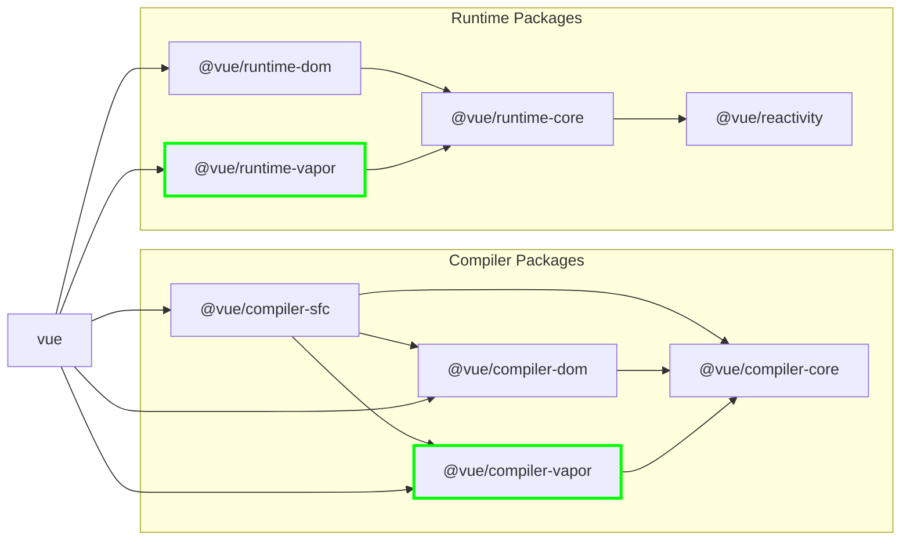

## 虚拟 DOM

Evan You 在2025年7月12日的深圳 Vueconf 2025 宣布了 Vue 3.6-alpha.

这个众所周知啊，世界上效率最高的 JavaScript 框架是 vanilla-js（笑）。原生 DOM 操作从 overhead 角度讲是最高效的，但是我们之所以连 jQuery 都不想写了，就是因为直接操作 DOM 心智负担太重了。用惯了框架再去写原生 DOM 操作，会有一种天天写 Python 今天突然让我用 C++ 从底层开始造轮子的感觉。

那有没有一种可能，可以在不改变现有 Vue 框架写法（不改变对框架使用者的API）的情况下，由编译器去生成高效的直接有针对性的操作 DOM 的代码？——毕竟，Svelte 和 Solid.js 已经在这条路上提供了很多经验。

## Vapor Mode

Vue 3.6 引入的 **Vapor 模式**，本质上是一种全新的编译渲染策略。它借鉴了 Solid.js 的思路，直接在编译阶段生成操作真实 DOM 的代码，以绕过虚拟 DOM 和 diff 流程。Vapor 模式是现有 Vue 功能的子集，仅支持 Composition API 与使用 Vue SFC 定义组件。

此外它暂不支持`<Transition>`、`<KeepAlive>` 与 SSR 等功能（所以很显然，Nuxt 现在用不了）。不过这几种功能会在 alpha -> beta 阶段逐步支持。

以下是一张来自 Evan You 在 [Vueconf 2025 主题演讲](https://www.bilibili.com/video/BV1fyu9zsEAf/) 的演示图——



### a. 模板编译与真实DOM克隆

Vapor模式在编译阶段将组件的HTML模板转换成一个“工厂函数”。这个函数的核心是一个`<template>`元素，它包含了组件的静态HTML结构。For example：

```vue
<script setup vapor>
import { ref } from 'vue'
const count = ref(0)
</script>

<template>
  <button @click="count++">
    Count: {{ count }}
  </button>
</template>
```

对于以上单文件组件，Vapor模式会生成如下的代码：

```javascript
// 编译产物中的模板函数
const t0 = template("<div><h1>Hello World</h1><button> </button></div>");

// template() 函数内部大致实现
let t;
function template(html) {
  let node;
  return () => {
    if (!node) {
      t = t || document.createElement("template");
      t.innerHTML = html;
      node = child(t.content); // 获取template内的第一个真实节点
    }
    // 每次调用都克隆真实DOM节点
    return node.cloneNode(true);
  };
}
```
当组件被渲染时，这个工厂函数被调用，通过 `cloneNode(true)` 创建出真实的DOM结构。

### b. 精确的DOM节点导航

编译器会分析模板结构，并生成直接、精确的代码来定位到需要动态更新的DOM节点。

```javascript
// 获取对特定DOM节点的引用
const n1 = t0(); // n1 是 <div>
const n0 = next(child(n1)); // n0 是 <button>
const x0 = child(n0); // x0 是 <button> 内部的文本节点
```
这种方式避免了在运行时进行树的遍历和查找，所有路径在编译时就已经确定。

### c. 响应式与渲染的直接绑定

Vapor模式使用 `renderEffect` 将响应式数据的变化与具体的DOM更新操作直接绑定。

```javascript
const count = ref(0);

// 当 count.value 变化时，只执行 setText 更新文本节点
renderEffect(() => setText(x0, "Count is " + toDisplayString(count.value)));

// setText 直接操作DOM
function setText(el, value) {
  if (el.$txt !== value) {
    el.nodeValue = el.$txt = value;
  }
}
```

只有依赖的响应式数据发生变化时，`renderEffect` 的回调才会执行。编译器确保这个回调“最小化”，只包含必要的 DOM 操作。

### d. 高效的事件处理

通过事件委托（Event Delegation）来优化事件监听。事件监听器被添加到 `document` 级别，而不是每个元素上，从而减少内存占用和事件设置的开销。

```javascript
delegateEvents("click"); // 在document上监听click事件
n0.$evtclick = () => count.value++; // 在DOM节点上附加一个属性来存储处理器
```
全局的 `delegatedEventHandler` 会在事件触发时，根据事件路径找到对应的元素及其处理器并执行。

## 启动 Vapor

目前只需在 SFC 的 `<script setup>` 标签加上 `vapor` 属性，变成 `<script setup vapor>`，编译器就会以 Vapor 模式进行编译。